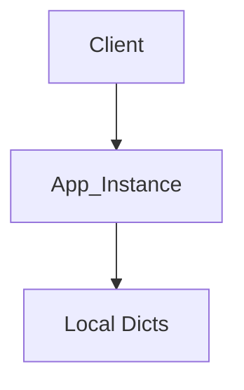
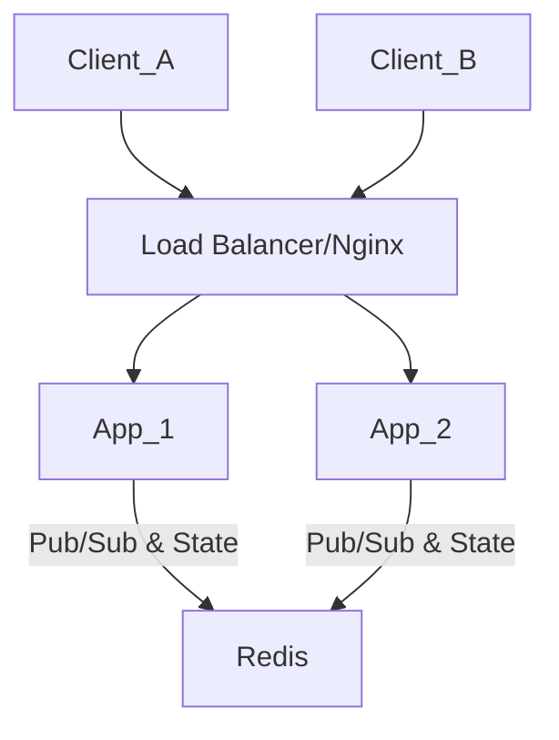

# Track Specification: Horizontal Scaling with Redis

## Overview
This track focuses on transitioning the application's real-time WebSocket architecture from a single-node, in-memory state to a distributed, horizontally scalable system using Redis. This will allow multiple application instances to run simultaneously while maintaining synchronized state and successful event broadcasting across all connected clients.

## Problem Statement
Currently, the `SocketIOService` relies on local Python dictionaries (`active_users`, `global_users`) to track user presence and connection state.
1. **State Isolation:** If we spin up two application containers, `Container A` will not know about users connected to `Container B`.
2. **Broadcast Limitation:** An event emitted from `Container A` will only reach clients connected to `Container A`. Clients on `Container B` will miss the update.
3. **Memory Leak Risk:** Unbounded in-memory dictionaries can grow indefinitely if not managed perfectly.

## Proposed Solution

### 1. Infrastructure: Redis
We will introduce Redis 7 (Alpine) as a backing service. Redis will serve two distinct roles:
1. **Socket.IO Message Queue:** It will act as the Pub/Sub layer for Flask-SocketIO, allowing nodes to forward emitted events to all other nodes.
2. **Shared State Store:** It will replace the in-memory dictionaries for tracking "Who is online" and "Who is viewing which board".

### 2. Architecture Changes

#### Before

#### After

### 3. Implementation Details

#### A. Docker & Configuration
- Add `redis` service to `docker-compose.yml`.
- Add `REDIS_URL` to `config.py` (default: `redis://redis:6379/0`).
- Add `redis` package to `requirements.txt`.

#### B. Socket.IO Configuration
- Initialize `SocketIO(message_queue=app.config['REDIS_URL'])` in `app/extensions.py`. This standardizes the multi-node broadcasting.

#### C. State Management Refactor (`app/socket_events.py`)
We will move from `active_users` (Dict) to Redis structures.

| Current (Python Dict) | New (Redis) | Key Pattern | Type |
| :--- | :--- | :--- | :--- |
| `active_users[board_id]` | Board Presence | `board:{id}:users` | Set (of user_ids) |
| `global_users[user_id]` | User Connection Count | `user:{id}:connections` | Integer (Incr/Decr) |

*Note: We may also store user metadata in a Hash `user:{id}:meta` if needed to avoid DB lookups on every presence check.*

## Acceptance Criteria
- [ ] Redis is running in Docker.
- [ ] `requirements.txt` includes necessary drivers.
- [ ] Application connects to Redis on startup.
- [ ] `socket_events.py` no longer uses global `active_users` or `global_users` dictionaries.
- [ ] User presence (joining/leaving a board) is correctly tracked in Redis.
- [ ] Events emitted from one "worker" (simulated or real) reach clients effectively.
- [ ] Code follows the existing style guide.
